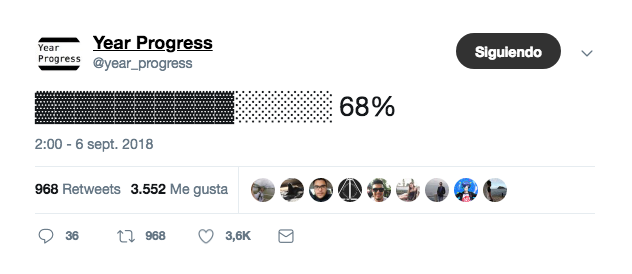
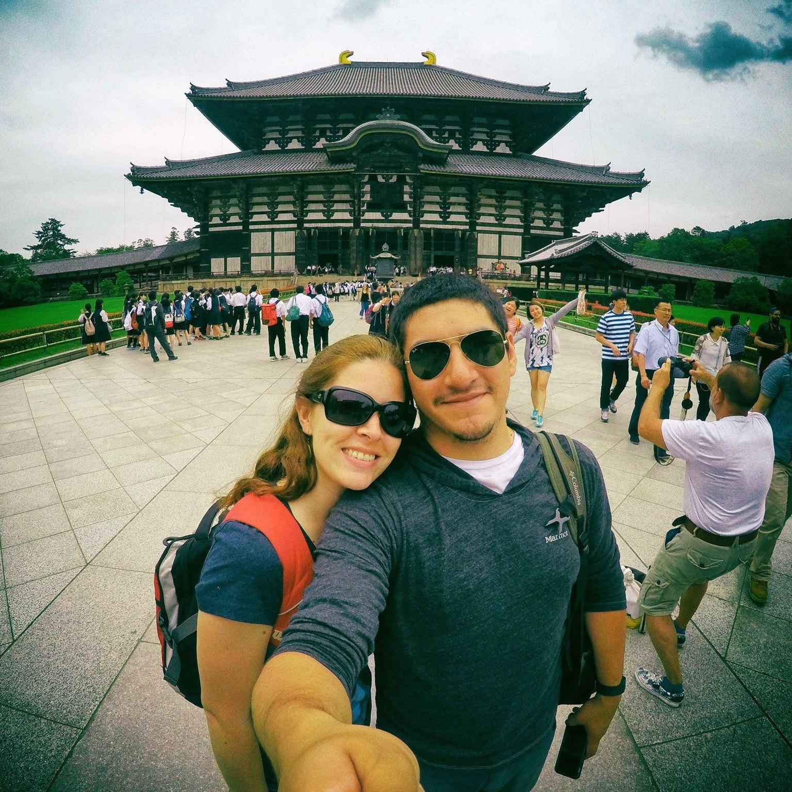

The year is not over yet. It just feels like it.

I wrote [a post](https://www.indiehackers.com/forum/the-117-day-challenge-ca4543e4e3) for the Indie Hackers community yesterday about something that's been in my head these past few days. There are 117 days left in the year (including today). That's 100 days + 17 Sundays, which is the right amount of time needed to complete a nice little 100-day challenge before the end of the year, while still being able to take a day off each week to get some rest.

But deciding that I wanted to do _something_ with the rest of my year, was way easier than deciding exactly _what_ to do. I've been thinking a lot lately about what my personal challenge should be. There are just too many things to consider, _specially_ time constraints. I've recently started taking some college classes with the hope of getting a degree in Data Science sometime next year, and that's basically sucking all of my free time. So my challenge needs to be **a)** interesting (otherwise I wouldn't keep up with it for 100 days), and **b)** not very time-consuming.

I already have some daily habits that I try to do every day or at least 6 times a week, like reading, exercising and meditating. But my challenge can't be related to any of those; since I'm already doing these things every day, it wouldn't be much of an actual _challenge_.

So after much consideration, and an in-depth review of my "Someday / Maybe" list, I finally decided that I'm going to do the thing that I wanted to do since I was 14 years old. **I'm going to learn Japanese.**

Actually, it'd be more accurate to say that I'm going to _study_ Japanese. Yes, hopefully I'd end up learning something after studying it for 100 days, but that's not what the challenge is about. This is more than a test on self-discipline than anything else. It's about making very little progress every day, without excuse. It's a way to prove myself that no matter how busy I think I am, or how overwhelmed I might feel, I can still find a little bit of time in my day to sit down, and do the thing.

If you're curious, [this is the course](https://www.udemy.com/japanese-in-context) that I'll be taking. I've purchased it a couple years ago before my trip to Japan, and of course, I abandoned it after I came back. This time, I'm sure things will be different. Today is Day 1.

じゃあね jaa ne!

